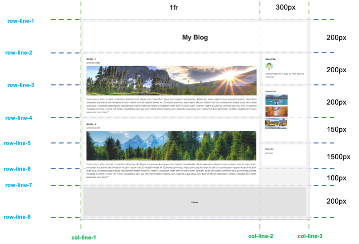

# UIB_Layout_Grid_Exercise-2

Grid layout example, which is NOT responsive.

## Layout design

## The online version

In order to see live version, just [click...!](https://hsnakk.github.io/UIB_Layout_Grid_Exercise-2/)
